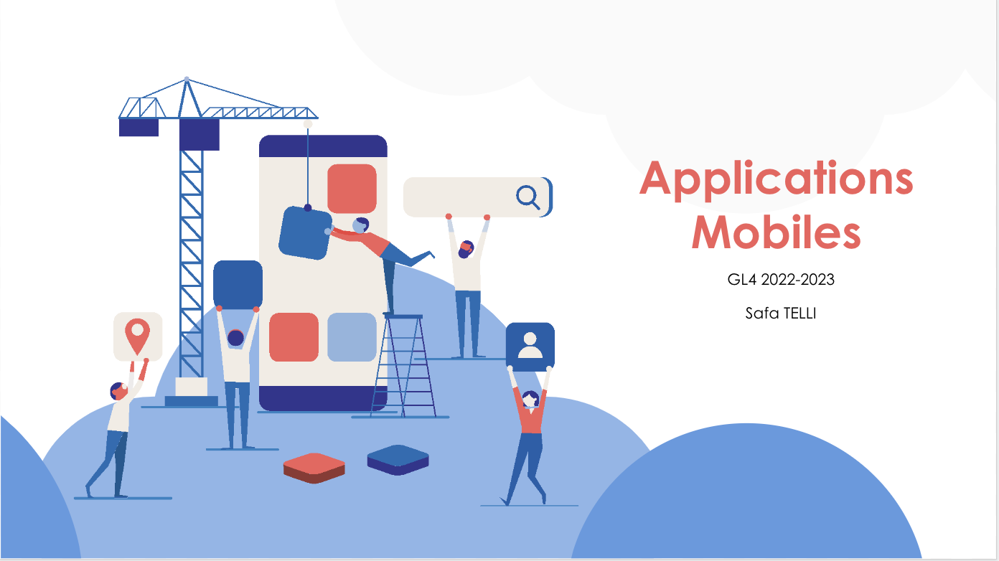

# TP Android - GL4

Ce cours comporte 6 séances de travaux pratiques:

- TP1: Création des interfaces graphiques et navigation
- TP2: Éléments Graphiques avancés : RecyclerView
- TP3: Création des Fragments
- TP4: Base de données interne / Firebase
- TP5: Connexion à des services web REST
- TP6: MVVM avec Android