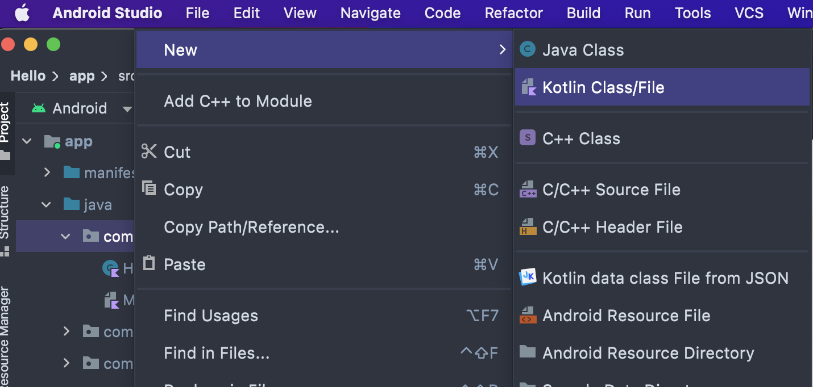
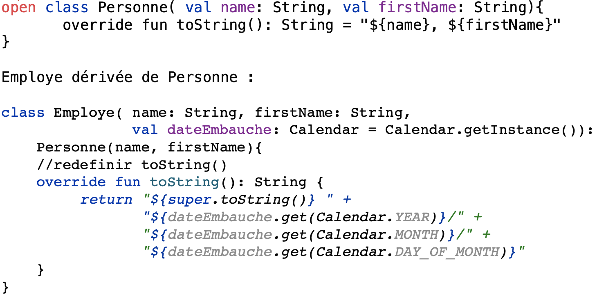
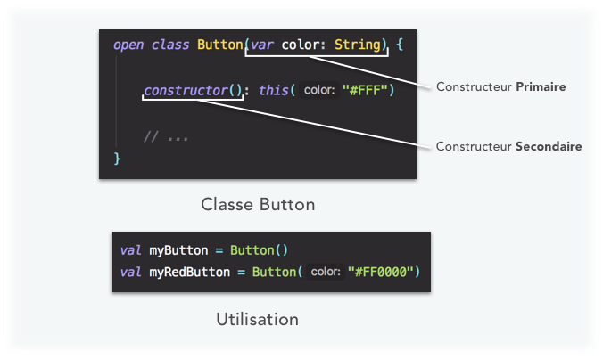

# Initiation au langage Kotlin


## Objectifs du TP
- Dans ce TP nous allons nous familiariser avec le langage kotlin

## Langage Kotlin
- Kotlin a été développé par JetBrains dans l’objectif de pallier les limitations qu’imposait Java dans le développement de ses différents produits.

- Kotlin est un langage de programmation "statiquement typé" supportant néanmoins "l’inférence de type" grâce à son compilateur.

- Kotlin supporte la "programmation orientée objet" et la "programmation fonctionnelle".

- Kotlin est open source, supporte la plupart des IDE et fonctionne sur la majorité des plateformes Java actuelles (où le bytecode JVM est accepté)

- En 2017, Google a annoncé lors de sa conférence Google I/O, que kotlin est désormais son langage préféré pour les développeurs d'applications Android.

## Première application kotlin

1. Lancer AndroidStudio
2. File -> New -> New Project
3. Sélectionner "No Activity" (pour une application sur le terminal)
{height=300 }

4. Choisir le nom du projet (ici Hello)
5. Le nom de package (ici com.gl4.tp)
6. Le répertoire du projet
7. Langage (Kotlin)

8. File -> New ->Kotlin Class/File pour ajouter le fichier source
{height=200 }

9. Choisir le nom du fichier (Hello.kt)
{height=200 }

10. Le programme doit contenir fonction main suivante :

``` java
fun main(argv : Array<String> )){
    print("Hello")
}
```
11. Exécuter le programme en choisisant : Run 'HelloKt'
{height=200 }
Voici le résultat :
{height=200 }

## Les variables
{height=200 }

La mention du type d'une variable n'est pas obligatoire en Kotlin. Le compilateur de Kotlin possède une fonctionnalité appelée "l’inférence de type", ou "type inference", en anglais. Pour que cela soit plus parlant, comprenez par "inférence" la notion de "déduction" ! . Kotlin se voulant être un langage très intelligent, ses développeurs ont souhaité lui offrir les avantages de lisibilité des langages "dynamiquement typés", mais sans leurs inconvénients. En effet, pour Kotlin, ce sera au moment de la compilation (et non au moment de l’exécution) que les types de vos variables seront automatiquement déduit.
``` java
val name: String = "Mohamed"
val age: Int = 27
val isDeveloper: Boolean = true
```
Equivaut à :

``` java
val name = "Mohamed"
val age = 27
val isDeveloper = true
```

### Les types nullables
Kotlin est un langage dit "sûr". Derrière cet adjectif réconfortant se cache en réalité un ensemble de fonctionnalités améliorant la sûreté du langage, dont la fameuse "**Null Safety**".
{height=200 }

Exemple concret : Copier le code suivant dans fonction main() crée au départ : 
``` java
var message: String? = "My message can possibly be null !"
message.upperCase()
```
Comme vous le voyez sur l’exemple ci-dessus, nous avons déclaré la variable  message  comme pouvant "possiblement" contenir une valeur nulle. Puis, lorsque nous souhaitons ensuite accéder à sa méthode  upperCase() , le compilateur Kotlin nous souligne en rouge le point précédant cette méthode pour nous dire que cela est impossible, car la variable peut être possiblement nulle.
{height=200,width=100 }

Pour gérer une variable possiblement nulle il faut utiliser le point d’interrogation afin d’appeler une de ses méthodes de manière sécurisée. Dès lors, si jamais la variable est égale à nulle, la méthode ne sera tout simplement pas appelée ! En revanche, si la variable contient bien une valeur, alors la méthode sera appelée et exécutée.
``` java
var message: String? = "My message can possibly be null !"
message.upperCase()
```

### L' opérateur !!.
l'opérateur d'assertion non nul (!!) convertit toute valeur en un type non nul et lève une exception si la valeur est nulle. Vous pouvez écrire x!!, et cela renverra une valeur non nulle de x (par exemple, une chaîne) ou lancera un NullPointerException si x est null :
``` java
val ville = personnel[i]!!.adresse!!.city
```
//si personnel[i] ou adresse est égale à null alors NullPointerException, par contre city peut être null
### L' opérateur elvis ?:
``` java
var s = savedInstanceState?.getInt("key") ?: 0
```
Si la valeur de savedInstanceState?.getInt("key") est un Int alors s prendra cette valeur, si
la valeur de cette expression est null alors s prendra la valeur 0

### Le mot clé lateinit
Imaginez que vous ne souhaitiez pas initialiser votre variable immédiatement après sa déclaration, mais le faire un peu plus tard dans votre code (quand par exemple une page ou un écran a terminé de charger).
Vous allez tout simplement utiliser le mot-clé  ***lateinit*** (pour "Late-Initialized") permettant d’indiquer à Kotlin que vous êtes sûr et certain d’initialiser la variable en question, un peu plus tard dans votre code :
``` java
private lateinit var submitButton: Button 
```
### Le symbole $
Kotlin nous permet de manipuler un peu plus simplement les variables de type  String  . Nous allons pouvoir, par exemple, utiliser le symbole  $  afin de faire référence à une variable locale directement à l’intérieur d’un autre  String  :
``` java
val name = "Mohamed"
print("Hello $name")
```

!!! Activité

        Copier le code suivant et le corriger :

        ``` java
        
                val hello = "Hello"
                hello = "Hello world!"
                
                println(hello)
                
                var toto:Int = "Toto"
                
                println(toto)
                
                var message: String? = "I’m learning Kotlin!"
                message = null
                println(message.toString())      
        ```


## Les fonctions
{height=200,width=100 }


{height=200,width=100 }

!!! Activité

        Ecrire une fonction qui prend 2 valeurs en paramètres et retourne leurs somme.

        Corriger cette fonction:

        ``` java

          fun sayMyName() { println(" $name ") }          
        ```
         Simplifier cette fonction:

        ``` java

          fun sayHello(): String {return "Hello"}        
        ```


## Les boucles 
{height=200,width=100 }
## Les listes
En Kotlin, vous aurez la possibilité de créer très facilement des listes de valeurs afin de lier différentes données entre elles.
Nous allons ainsi pouvoir appeler les méthodes génériques suivantes :


- ***listOf***  : Permet de créer une liste d’éléments ordonnée et immuable.

- ***mutableListOf***  : Permet de créer une liste d’éléments ordonnée et muable.

- ***setOf***  : Permet de créer une liste d’éléments désordonnée et immuable.

- ***mutableSetOf***  : Permet de créer une liste d’éléments désordonnée et muable.

``` java
 // listOf
val listOfNames = listOf("Jake Wharton", "Joe Birch", "Robert Martin")
listOfNames[0] // => Jake Wharton
listOfNames[0] = "Mathieu Nebra" // => ERROR ! List is immutable

// mutableListOf
val listOfNames = mutableListOf("Jake Wharton", "Joe Birch", "Robert Martin")
listOfNames[0] // => Jake Wharton
listOfNames[0] = "Mathieu Nebra" // => SUCCESS !

// setOf
val setOfNames = setOf("Jake Wharton", "Joe Birch", "Robert Martin")
listOfNames.first() // => Jake Wharton
listOfNames.add("Mathieu Nebra") // => ERROR ! Set is immutable

// mutableSetOf
val setOfNames = mutableSetOf("Jake Wharton", "Joe Birch", "Robert Martin")
listOfNames.first() // => Jake Wharton
listOfNames.add("Mathieu Nebra") // => SUCCESS !    
```


!!! info
    Sachez également qu’il existe d’autres méthodes comme ***arrayOf*** pour créer un tableau de valeurs, et même  ***mapOf***  pour créer un dictionnaire de valeurs.


!!! Activité

        ``` java

          fun showList(list: List<String>){
            // Complétez la fonction pour afficher les éléments de la liste
            }      

        ```
        ``` java

          fun oddNumbersTo10(){
                // Complétez la fonction pour afficher les nombres impairs jusqu'à 10
            }       
        ```

        ``` java

            private val languages =  // Créez une liste ordonnée de plusieurs languages de programation

            fun main(args: Array<String>) {
                println("Languages :")
                showList(languages)
                println("Odd Numbers to 10 :")
                oddNumbersTo10()
            }      
        ```


           


## Les choix et les conditions
### if ... else 
Toutes les structures de contrôle (à l’exception des boucles) sont des ***expressions***, et pourront donc renvoyer une valeur. D’ailleurs, en Kotlin, l’opérateur ternaire n’existe plus : on préférera utiliser une condition if/else.

``` java

    var a = 10
    var b = 12

    val result = if (a > b){
                a++
                a
            } else {
                b++
                b
            }
    print("Result is : $result")       
```


### selon ...

La fameuse switch de Java, existe en kotlin mais avec une autre identité. Oubliez ***switch*** et utilisez à la place le mot-clé  ***when***.
``` java

val number  = 15
when(number){
        1 -> print("Un")
        2 -> print("Deux")
        3 -> print("Trois")
        else -> print("Inconnu")
    }      
```
!!! Activité
    Créer une fonction qui prend en paramètres deux entiers et un opérateur ( +, -, /,*, %) et renvoit le résultat de l'opération.
    Tester la fonction. 

## Les classes

{height=200,width=100 }

 En Kotlin, la visibilité par défaut de n’importe quel élément de votre code (variables, fonctions, classes, etc.) est  public . Il existe 4 principaux modificateurs de visibilité pour les membres (variables, fonctions, etc.) d’une classe :

- private  : Un membre déclaré comme  private  sera visible uniquement dans la classe où il est déclaré.

- protected  : Un membre déclaré comme  protected  sera visible uniquement dans la classe où il est déclaré ET dans ses sous-classes (via l’héritage).

- internal : Un membre déclaré comme  internal  sera visible par tous ceux du même module. Un module est un ensemble de fichiers compilés ensemble (comme une librairie Gradle ou Maven, par exemple).

- public  : Un membre déclaré comme  public  sera visible partout et par tout le monde.

Pour pouvoir personnaliser un getter() ou un setter() en kotlin, il faut utiliser les mots clés get()  et  set() dans le corps de la classe. Exemple : 
``` java

class User(email: String, var password: String, var age: Int){
    var email: String = email
        get() { 
            println("User is getting his email."); 
            return field 
        }
        set(value) { 
            println("User is setting his email"); 
            field = value 
        }
}      
```

Si nous souhaitons définir la propriété  password  comme étant privée, nous pouvons le faire en rajoutant le mot-clé  ***private***  devant sa déclaration :
``` java

class User(var email: String, private var passwird: String, var age: Int)     
```


### L'heritage
en Kotlin, toutes les classes et leurs méthodes sont "fermées" par défaut. Vous ne pourrez donc pas hériter d’une classe ou redéfinir ses méthodes sans l’autorisation explicite.
Ainsi, il faut indiquer explicitement, avec au mot-clé  ***open***  , si une classe ou une méthode peut être "ouverte" à l’héritage.

Les modificateurs d’accès disponibles en Kotlin (à ne pas confondre avec les modificateurs de visibilité!) :

- ***final*** : Classe/Méthode/Propriété ne pouvant pas être redéfinie. C’est l’état par défaut de tous les éléments en Kotlin.

- ***open***  : Classe/Méthode/Propriété pouvant être redéfinie. Ce modificateur d’accès doit être indiqué explicitement.

- ***abstract***  : Classe/Méthode/Propriété devant être redéfinie. Ce modificateur d’accès peut être utilisé uniquement dans des classes abstraites.

Et bien entendu, le mot-clé  ***override***  sera utilisé pour redéfinir un élément d’une classe parente (ou d’une interface).

{height=200,width=100 }

### Les constructeurs multiples
Pour créer un second constructeur, il faut utiliser le mot clé ***constructor***
{height=200,width=100 }

### Les classes de données
En Kotlin, nous pouvons définir une classe comme étant destinée à contenir des modèles de données grâce au mot-clé  ***data***  :
``` java

data class User(var email: String, var password: String, var isConnected: Boolean)
```
Grâce à ce simple mot-clé, le compilateur Kotlin implémentera pour nous les principales méthodes utilisées pour "comparer" et "décrire" un objet contenant des données comme les méthodes  ***toString()***  ,  ***hashCode()***  , ***equals()***  ou encore  ***copy()***.


## Function types
Il est possible d'avoir les variables de type fonction (quicontiennent une référence vers une fonction) et il est possible
de passer une fonction comme paramètre d'une autre fonction.
``` java

fun appl( a: List<Int>, b: List<Int>,
          f: (Int,Int)-> Int ) : MutableList<Int> {
    var r = mutableListOf<Int>()
    val s = if (a.size < b.size) a.size else b.size
    for( i in 0..s-1 )
        r.add( f( a[i], b[i] ) )
    return r
}
```
appl() prend comme paramètres deux listes de Int et le troisième paramètre ***f: (Int,Int)-> Int*** est une fonction qui prend deux Int et retourne un Int. La fonction appl() construit une nouvelle liste obtenue en appliquant f aux couples correspondants de listes a et b.
``` java

fun fu ( i: Int, j: Int) : Int { return i*i + j*j }
val q = listOf( 2, 6, 8 , 99)
val p = listOf<Int>( -1, 7, 90, 14)
//passer une fonction en paramètre
val res = appl(p, q, ::fu ) //le nom de fonction précédé par :: ou par NomClasse:: si la fonction est définie dans une classe
```


## Fonctions comme paramètres, lambda-expressions
``` java
val res2 = appl( p, q , {a , b -> a*b }) 
```
``` java
{ a, b -> a * b }
```
C'est une lambda expression qui désigne une fonction sans nom avec les arguments a, b. Le compilateur déduit le type de paramètres de la définition de appl().

Lambda expression avec le type de paramètres :
``` java
{a : Int , b : Int -> val x = a-b
 x * x
}
```
La valeur de lambda expression est la dernière valeur calculée dans le corps de la fonction.


Si lambda expression est le dernier argument d'une fonction alors on peut la
mettre en dehors des parenthèses.


``` java
val q = listOf( 2, 6, 8 , 99)
val p = listOf<Int>( -1, 7, 90, 14)
val res2 = appl( p, q ) {a , b -> (a-b)*(a-b) }
```

!!! Exercice
    1. Dans Android Studio, créez l’application TP01. Suivez les instructions données dans ce TP pour créer une application à exécuter sur un terminal.
    2. ***Hello***

        Pour voir si votre application est correctement générée dans AndroidStudio mettre dans la fonction
        main() l’affichage de "Hello" et tester si votre programme s’exécute correctement.
    2. ***classe Point***

        Définir la classe Point qui correspond à un point sur le, plan avec les coordonnées entières x et y.
        La classe Point sera déclaré comme data class.

    3. ***distance***

        Écrire la fonction distance qui prend comme argument deux points et calcule la distance entre
        eux. On suppose que la distance entre les point p et q est |p.x − q.x| + |p.y − q.y| (donc c’est un Int)..
    4. ***classe Rectangle***

        La classe Rectangle représente un rectangle sur le plan dont les sommets ont les coordonnées entières. Un tel rectangle est définie de faço,n unique par deux de ses sommets, le sommet p en bas à gauche et q en haut à droite.

        - Écrire la classe Rectangle avec un constructeur qui prend comme paramètres les points p et q. Les valeurs par défaut pour les deux points sont respectivement (0, 0) et (1, 1).
        - Redéfinir la méthode toString() de Rectangle pour qu’elle retourne "p=$p q=$q".
        - Définir dans main() un Array composée de plusieurs rectangles. Pour définir les rectangles utilisez aussi les valeurs par défaut (un rectangles avec p et q par défaut, un rectangle avec la valeur p par défaut et q défini à la création de rectangle, un rectangle avec la valeur q par défaut et p défini à la création de rectangle, etc.)
        - Dans la classe Rectangle ajouter la méthode surface qui retourne la surface de rectangle.
        - Dans main afficher la surface de chaque rectangle qui est dans le tableau défini précédemment.

