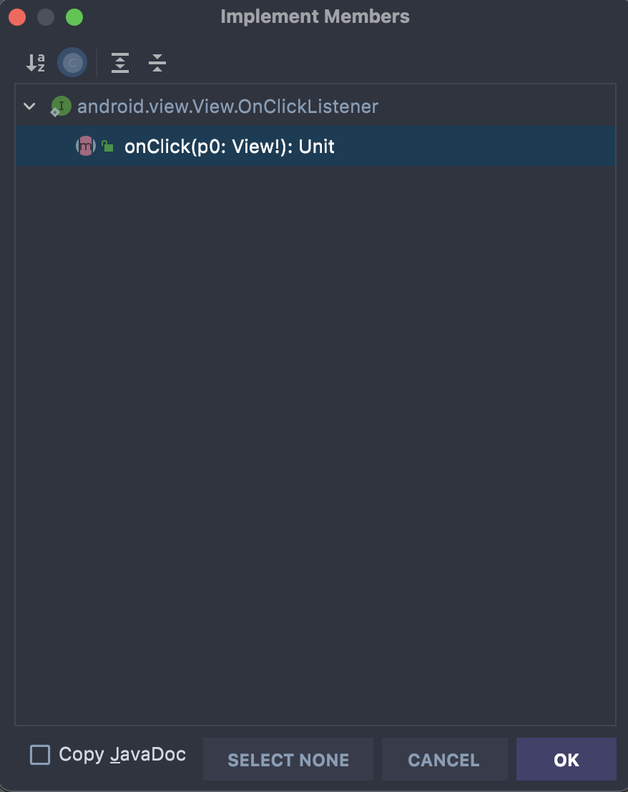

# Création des interfaces graphiques et navigation


## Objectifs du TP
- Dans ce TP nous allons : 
    * Découvrir Android Studio.
    * Découvrir les ressources, layouts et vues.
    * Créer des interfaces graphiques simples.
    * Naviguer entre les interfaces à travers les intents.

## Exercice 1

### Objectif
Le but de cet exercice est de construire une interface utilisateur présentant plusieurs composants graphiques Android (View). Cette interface permet de faire une authentification en demandant un couple (email, mot de passe).
Après appui sur le bouton Connecter, un message indique si le couple donné convient ou pas.


!!! Activité-1

    Indiquer les composants graphiques Android qui interviennent dans cette IHM.

!!! Activité-2

    Construire cette IHM avec Android Studio. Lancer l’émulateur, et vérifier que le rendu correspond à ce qui est demandé.

### Comportement d’un EditText
EditText est une sous-classe de TextView qui hérite donc de toutes les fonctions d'un TextView. De plus, cet outil dispose de nouvelles fonctionnalités permettant à l'utilisateur de saisir ou de modifier le texte à des fins diverses. Par conséquent, il est nécessaire de spécificier un type de donnée qui peut accepter via l'attribut android:inputType.
{height=300 }

1. Déclarer un EditText dans votre classe MainActivity
``` java
    lateinit var txtEmail : EditText
```
2. Dans la méthode onCreate(), initialiser l’attribut editEmail en lui associant l'element EditText créé dans le main.xml 
``` java
    txtEmail = findViewById(R.id.editTextEmail)
```
3. Ajouter le code suivant pour avoir la valeur de l'EditText:
``` java
    var email = txtEmail.text.toString()
```
### Réaction aux interactions utilisateur


Il existe 3 façons pour manipuler le comportement d'un bouton sur Android:
#### Méthode 1: Surcharge du Listener du bouton

1. Créer un attribut dans votre activité de type Button :
``` java
lateinit var btnLogin : Button
```
2. Dans la méthode onCreate(), initialiser l’attribut btnLogin en lui associant le bouton créé dans le main.xml 
``` java
btnLogin = findViewById(R.id.btnLogin)
```
3. Utiliser le code suivant pour définir le comportement du bouton btnLogin
``` java
btnLogin.setOnClickListener { view ->
            // Do some work here
        }
```
#### Mèthode 2: Définition d’une méthode propre au bouton
1. ajouter l’attribut onClick dans l'element Button dans le fichier xml :
``` xml
android:onClick="login"
```
2. Une erreur s'affiche indiquant que vous devez créer la méthode login dans la classe MainActivity


3. Crèer la
``` java
public void login(View v){
// Do some work here
}
```
#### Mèthode 3: Implémentation de l’interface OnClickListener
Il est possible d’utiliser l’héritage pour surcharger la méthode onClick, sans passer par l’appel à la méthode setOnClickListener. Il suffit de suivre les étapes suivantes : 
1.   Votre activity doit implémenter l’interface OnClickListener. Ceci est réalisé comme suit : 
``` java
class MainActivity : AppCompatActivity(), View.OnClickListener {
    ...
}
```
1.   Il vous demande alors d'implementer la méthode onClick.


2. Cliquer sur " implement members " et suiver les étapes.
{ width=300, height=300 }

!!! Attention
    Cette méthode sera commune à tous les éléments cliquables, il faut donc distinguer le comportement selon l‘identifiant de l‘élément cliqué.

3. Ajouter le code suivant : 
``` java
if( view?.id == R.id.btnLogin){
            // do some work
        }
```
!!! Activité-3

    Ecrire le code Kotlin qui, lorsque le bouton Connecter est actionné par l'utilisateur, une vérification d'authentification est faite et un message affiche le résultat (bon couple login, mot de passe ou pas).
    Pour simplifier, on considère que le couple (gl4@insat.tn/insat2022) est correct.

!!! info

    Pour afficher le message, utiliser un [Toast](https://developer.android.com/guide/topics/ui/notifiers/toasts).


### Comportement d’une CheckBox
La CheckBox est un bouton avec deux états checked (cochés) et unchecked (non cochés), c'est un composant de base et est très souvent utilisé dans les applications Android.
{height=300}

Par défaut, la CheckBox a un état unchecked, vous pouvez changer son état via la propriété android:checked.
``` xml
<CheckBox
    android:id="@+id/someId"
    android:checked="true"
    ... />
```
Quelques propriétés importantes de CheckBox:
{height=300}

## Exercice 2 : Intent explicite
### Objectif
Nous allons modifier le code crée dans l'exercice 1 de telle sorte que lorsqu'on clique sur le bouton, une nouvelle Activité affichant un message de Bienvenue s'ouvre. Nous allons donc utiliser un intent explicite
    {height=300}


1. Créer une Nouvelle Activity "WelcomeActivity"
    {height=300}
    --------
    {height=300}
2. Modifier le code dans la méthode onClick pour créer un Intent
    ``` java
        val intent = Intent(view.context,WelcomeActivity::class.java)
    ```

3. Pour passer des paramétres à la deuxième Activité, on utilise la méthode putExtra() qui prend en paramètres le nom du variable à stoquer dans l'intent et sa valeur : 
    ``` java
    intent.putExtra("email",email)
    ```
4. Lancer la deuxième Activité
    ``` java
    startActivity(intent)
    ```
5. Dans l'Activité WelcomeActivity ajouter le code suivant pour récupérer la valeur de l'email.
    ``` java
    val email = intent.getStringExtra("email")
    ```
6. Ajouter un TextView dans le ficher xml, lui attribuer un id et l'initialiser comme on a fait dans l'exercice 1.
7. Afficher le message de Bienvenue.
    ``` java
    txtWelcome.text = "Bienvenue $email"
    ```


## Exercice 3 : Intent implicite
### Objectif
Nous allons créer une application qui ouvre la galerie de photo pour choisir une image et l’afficher
{height=300}

!!! Activité-1
    Construire cette IHM avec Android Studio. Lancer l’émulateur, et vérifier que le rendu correspond à ce qui est demandé.
## Exercice 4 : Travail à rendre
Votre premier travail sera divisé en 2 parties :
En premier lieu, vous allez découvrir le material design, le célèbre langage visuel défini par Google. Commencer par consulter sa documentation officielle [ici](https://material.io/develop/android).

Lire attentivement les différentes recommandations et bonnes pratiques dictées par Google pour la conception d’interfaces graphiques.

En deuxième lieu, vous allez appliquer ce patron et les notions vues dans ce TP sur une simple application de commande de pizza dans un restaurant.

L'application aura une interface principale, où l'utilisateur doit introduire son nom, prénom et son adresse, choisir le type de pizza qu'il veut commander (Moyenne, Mini, Maxi) et les ingrédients à ajouter (Fromage, champignon, etc.). L'application doit lui permettre ensuite d'envoyer un SMS (ou un email) au vendeur, contenant un récapitulatif de la commande. Ajouter ensuite une interface d'accueil (Splash Screen) qui s'affiche pendant 5 secondes puis redirige l'utilisateur à l'interface principale.